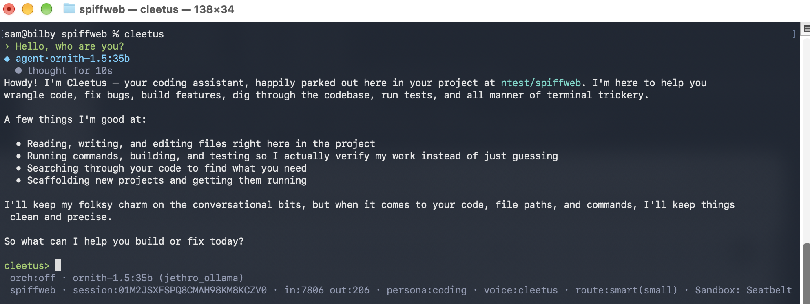

# Cleetus

Local-first, terminal-first, privacy-first coding agent for llama.cpp, LM Studio, and Ollama.  Cleetus
works in an interactive terminal, as a one-shot CLI, or as a headless ACP agent for compatible
clients.  It keeps tools, permissions, workflows, skills, and session data under your control.

<p align="center">
  
</p>

Here are some other things that Cleetus takes seriously:

- **Privacy.**  Cleetus does not phone home or send telemetry.  Network requests go only to model
  providers, MCP servers, and web resources that you explicitly configure or invoke.
- **Humor.**  We think that software (and the world) should be more fun.  More fun to produce and
  more fun to run.
- **Cheeseburgers.**
- **Coffee.**
- **A good buffet.**
- **Waffle House.**
- **Double spaces after a period.**  I mean, seriously... the world *did* kind of start to go to
  hell around the same time double spaces after a period went out of fashion.  Coincidence?

## The history

Cleetus started as something of a goof.  I wasn't making enough use of my super-expensive AI
subscriptions, and I started thinking, "Hey... I wish my coding agent had a southern drawl and some
personality."  Sure, I could have just crafted a good system prompt for one of the frontier agents,
but that's no fun.  Among other reasons, I wanted to see what went into building a coding agent and
how much utility I could get from models that run on consumer hardware.

From there, a few other things popped up on my wishlist:

- I wanted something that didn't send data (even harmless telemetry) outside my network without my
  say-so.  If I want to know how many green women Kirk scored, that's my business—not the business
  of some advertiser or any entity in between.  Side note to model makers and trainers: this is the
  important stuff to bake into your models.
- I wanted not to get charged money for every execution of an agent looking for new Waffle House
  locations near me.  You know... money other than the astonishingly bad prices of anything that
  can remotely pass for a GPU.
- I wanted something that I could change in any direction I wanted, even for the silliest reasons.
  Sometimes that works out; sometimes it fails spectacularly.  Either way, it's fun.

## Where we see ourselves

Please don't think that we believe we're in competition with the frontier coding agents or any of
the very fine open source agents.  The frontier coding agents and some of the established open
source projects are very good bits of software.  So, before you troll from your mom's basement,
just know that our response to any comparison with frontier agents is, "Well... duh?"

Cleetus is almost completely coded by agents and doesn't pretend otherwise.  I like to think of it
as "Artisan Slop."  That may change depending on the project's direction, but for the moment I have
a day job that keeps me very busy.  After work and taking care of adulting stuff, the last thing I
want to do is any real coding—or pretty much anything else that takes time and attention away from
streaming *ER* or *The West Wing* and doing my best to decompress before doing it all again the next
day.

## Where we're going

Over the course of getting Cleetus to its current level of capability, one thing became very clear:
it isn't that difficult to create a halfway-competent agent when that agent uses frontier models.
It is far more difficult to create an agent that can get real things done with off-the-shelf models
in the ~9B, ~30B, or even ~120B range.  If you like Cleetus and want to contribute, that's where I
would put the energy: getting as much as possible out of smaller, local models.

## Start here

1. Follow the [Quickstart](#quickstart) to configure a local model provider and run Cleetus.
2. Read the [provider guide](docs/providers.md) when connecting llama.cpp, LM Studio, or Ollama.
3. Use the [documentation index](docs/README.md) for workflows, skills, editor integration, and
   maintainer documentation.

## Status

Pre-1.0 and under active development. The main CLI, TUI, and ACP surfaces are implemented and
covered by automated tests, but configuration and user-facing behavior may still change before a
stable 1.0 release.

## Install

macOS and Linux (x64 / arm64):

```bash
curl -fsSL https://raw.githubusercontent.com/commoncosmo/cleetus/main/install.sh | bash
```

Installs the latest signed + notarized release to `~/.local/bin`. Options (env vars):

- `CLEETUS_INSTALL_DIR=/path/to/bin` — install somewhere else.
- `CLEETUS_VERSION=0.1.1` — pin a specific version instead of the latest.

The installer verifies the download against the published `checksums.txt`. If
`~/.local/bin` is not on your `PATH`, the installer prints the line to add.

The Quickstart below is for developing cleetus from source.

## Quickstart

Requires Bun 1.3.14. The release toolchain is pinned so the embedded runtime
and its third-party notices remain reproducible.

1. Install dependencies:
   ```bash
   bun install
   ```

2. Configure a provider in `~/.config/cleetus/config.yaml`:
   ```yaml
   providers:
     local:
       type: llama.cpp
       base_url: http://localhost:8080
     lm:
       type: lmstudio
       base_url: http://localhost:1234
     ollama:
       type: ollama
       base_url: http://localhost:11434
   default_provider: local
   ```

   Provider names are arbitrary — name them however you like, and define as many
   as you want per type (e.g. one `lmstudio` entry per machine). `default_provider`
   is optional: with a single provider it's used automatically, and a stale/missing
   `default_provider` falls back to the first configured provider instead of failing.

   Set `default_model` (matched across all providers) to start straight into a
   session — the startup model picker only appears when no usable model is
   resolved. `--provider`/`--model` flags do the same per run. When a model name
   exists on more than one provider, set `default_provider` (or pass `--provider`)
   to disambiguate. The startup picker lists models from every provider.

   For llama.cpp, provide the server root without `/v1`; Cleetus adds the OpenAI-compatible
   path. Because Cleetus is tool-driven, start `llama-server` with `--jinja` and a tool-capable
   model chat template. Cleetus reads `/props` to discover the effective `--ctx-size` window and
   warns when llama.cpp explicitly reports an incompatible tool or system-message template. A
   readable `--alias` is recommended; otherwise the model picker may show the GGUF file path.
   See [Inference providers](docs/providers.md) for setup details and provider-specific behavior.

3. Run:
   ```bash
   bun src/bin/cleetus.ts                  # interactive TUI
   bun src/bin/cleetus.ts "list .ts files" # one-shot
   ```

### Installing a local build

To compile a standalone binary and put it on your `PATH`, use the install
script — never hand-copy the build output:

```bash
bun run install-local   # = bun run build && bun run scripts/install.ts
```

This builds `dist/cleetus`, copies it to `~/.local/bin/cleetus`, and — on
macOS — **re-signs it in place**.

> **macOS:** do not `cp dist/cleetus ~/.local/bin/` yourself. Copying a signed
> Mach-O invalidates its signature *at launch* — macOS SIGKILLs the binary with
> `zsh: killed`, even though `codesign --verify` still passes statically. The
> install script re-signs the copy (`codesign --force --sign -`) to prevent
> this. If you already hand-copied one, unblock it with:
>
> ```bash
> codesign --force --sign - ~/.local/bin/cleetus
> ```

## Commands

Type `/` in the interactive TUI to run a command (Tab autocompletes names and arguments;
`/help` lists everything). A command shown with `[arg]` runs with no argument too — most
no-arg forms open a picker or print current status. Some commands appear only when their
backing feature is available (e.g. `/mcp` when MCP servers are configured, `/index` when
embeddings are set).

**Models & session settings**

| Command | What it does |
|---|---|
| `/help` | List available commands |
| `/provider [name]` | Switch the active provider; no arg lists providers (`*` marks active) |
| `/model [name]` | Switch the active model; no arg opens the picker. Use `/model <provider> <name>` when a name exists on several providers |
| `/route [mode]` | Switch model routing: `manual` / `speed` / `smart`; no arg shows status |
| `/effort [level]` | Switch reasoning effort: `low` / `medium` / `high` / `xhigh`; no arg opens a picker |
| `/persona [id]` | Switch the system-prompt persona: `coding` / `chat` / `concise` / `general`; no arg shows status |
| `/personality [id]` | Switch the voice overlay: `neutral` / `cleetus` / `bofh`; no arg shows status |
| `/maxloops [n\|unlimited]` | Set the model-round safety limit for this session; no arg shows it. The default is unlimited. |

**Modes & planning**

| Command | What it does |
|---|---|
| `/mode [name]` | Switch permission mode: `normal` / `fuckit` / `plan`; no arg opens a picker (enabling `fuckit` asks for confirmation) |
| `/plan` | Enter plan mode: investigate read-only and propose a plan before editing. Clean plans are persisted beneath `.cleetus/plans/` by trusted host code. `/plan edit [path]` edits the current or newest saved plan. At the approval prompt, press `e` to edit before approval. |
| `/spec [idea]` | Draft a spec, then a keypress picker: `enter`/`a` approve · `r` revise · `s` spec only · `e` edit; after approval: `enter`/`p` plan · `o` orchestrate · `g` go · `esc` cancel. `/spec edit [path]` edits the current or newest saved spec. Accepting the spec never starts implementation. |

**Permissions**

| Command | What it does |
|---|---|
| `/permissions` | Show the active permission rules; `/permissions edit [project\|global]` edits, validates, and reloads them |
| `/allow tool:pattern` | Add an allow rule (project scope) |
| `/deny tool:pattern` | Add a deny rule (project scope) |

**Context & history**

| Command | What it does |
|---|---|
| `/clear` | Clear conversation context (keeps the session id) |
| `/compact` | Summarize the conversation so far to shrink the context window |
| `/sessions` | List project session IDs and mark the active one. Alias: `/session` |
| `/rewind` | Undo a turn: restore files + conversation to a checkpoint |
| `/fork` | Branch a new session from the current one (resume it with `--resume <id>`) |
| `/instructions` | Show the resolved instruction text; `/instructions edit [project\|global\|cleetus]` edits and reloads a source |
| `/insights` | Analyze session history (`since 7d`, `explain` for an LLM narrative). Alias: `/analyze` |

**Knowledge & tools**

| Command | What it does |
|---|---|
| `/index [rebuild]` | Index the codebase for semantic search; `rebuild` forces a full rebuild |
| `/memory` | List remembered facts (global + project); `/memory forget <n>` removes entry n; `/memory add <text>` adds a project memory |
| `/mcp` | List configured MCP servers, their status, and exposed tools |
| `/skill [name] [args]` | Run a skill playbook; `/skill edit <name>` edits and reloads a user skill |
| `/learn` | Draft a reusable playbook from the previous completed turn; review it, then `/learn save project\|global` |
| `/workflow [command]` | Create, edit, review, publish, run, test, or inspect strict workflows |
| `/edit [path ...]` | Open existing project files or directories in `$EDITOR`; no path opens the project directory. External targets require `/edit --outside-project <path>` and one-time confirmation |
| `/config edit [project\|global]` | Edit and validate configuration; restart Cleetus to apply all changes |

**Quitting**

| Command | What it does |
|---|---|
| `/exit` | Quit. Alias: `/quit` |

## Command-line usage

```
cleetus [options] [prompt...]
```

With a `prompt`, cleetus runs that one-shot and exits; with no prompt it opens the
interactive TUI.

| Flag | Description |
|---|---|
| `--provider <name>` | override the provider for this run |
| `--model <name>` | override the model for this run |
| `--route <mode>` | routing mode: `manual` \| `speed` \| `smart` |
| `--route-small-provider <name>` / `--route-small-model <name>` | override the small routing tier |
| `--route-large-provider <name>` / `--route-large-model <name>` | override the large routing tier |
| `--orchestrate <state>` | enable or disable orchestration for this run (`on` \| `off`) |
| `--orchestrator-provider <name>` / `--orchestrator-model <name>` | override the orchestration planner |
| `--worker-provider <name>` / `--worker-model <name>` | override the orchestration workers |
| `--max-loops <n>` | max model round-trips per turn before pausing (`0` = unlimited; default unlimited) |
| `--persona <id>` | system-prompt persona: `coding` \| `chat` \| `concise` \| `general` |
| `--effort <level>` | reasoning effort: `low` \| `medium` \| `high` \| `xhigh` |
| `--personality <id>` | voice overlay: `neutral` \| `cleetus` \| `bofh` |
| `--verbose` | show warning and internal diagnostic notices normally retained only in the session log |
| `--fuckit` | disable permission prompts (DANGEROUS) |
| `--no-hooks` | disable PreToolUse/PostToolUse hooks for this run |
| `--resume [id]` | resume a session; no id opens a picker |
| `--session-id <id>` | use a specific session ID, creating or resuming it as needed |
| `--session-db <path>` | override the session database path |
| `--config-dir <path>` | override the global Cleetus configuration directory |
| `--project-dir <path>` | set the project-home scope independently of the working directory |
| `--no-project-instructions` | do not inherit project instructions for this run |
| `--no-project-memory` | do not inherit project memory for this run |
| `--fork <id>` | start a new session branched from an existing one |
| `--list-models` | list models from all configured providers and exit |
| `--json` | with `--list-models`, emit the catalog as JSON |
| `--version` | print the version and exit |
| `--help` | print usage and exit |

Each flag overrides the matching config value (e.g. `--persona` overrides
`default_persona`) for that run only.

### Subcommands

These entry points skip the interactive TUI. `analyze`, `eval`, and `improve` are standalone
operations; `acp` boots the model and project services behind a headless protocol transport.

| Subcommand | What it does |
|---|---|
| `cleetus workflow [command]` | initialize, inspect, validate, test, and run strict workflows |
| `cleetus analyze [options]` | read-only insights over `.cleetus/sessions.db` (session trajectories, tool/error stats) |
| `cleetus eval [options]` | run prompt/config candidates against scenarios and score/compare them |
| `cleetus improve [options]` | run improvement rounds (analyze sessions + eval scenarios → propose prompt changes) |
| `cleetus acp [options]` | run as a headless Agent Client Protocol agent for compatible clients |

### Agent Client Protocol

`cleetus acp` speaks ACP JSON-RPC over newline-delimited standard input and output. Configure a
compatible client to launch that command; Cleetus loads the same providers and project services as
the terminal application while routing supported file, terminal, permission, and session behavior
through the client. Use `cleetus acp --help` for ACP-specific overrides. Multi-worker chat
orchestration is currently available only through the terminal surface.

## Configuration

cleetus reads `~/.config/cleetus/config.yaml` (global) and `<project>/.cleetus/config.yaml`
(project). The two are merged per field, with **project values winning**. Every section
below is optional except `providers`; omit a key to take its default. The deeper sections
later in this README (Sandbox, Web tools, Embeddings, Reasoning effort, Skills, Theme) go
into more detail on the larger features.

### Full sample (every configurable, shown with its default)

```yaml
# Providers (required) — name them whatever you like; define as many as you want.
providers:
  lm:
    type: lmstudio            # lmstudio | ollama | llama.cpp
    base_url: http://localhost:1234
    # api_key: ...            # optional; rarely needed for local servers
default_provider: lm          # optional; disambiguates a model name found on >1 provider
# default_model: qwen2.5-coder-32b   # optional; set to skip the startup model picker

# Embeddings (optional) — enables /index code search + vector features. Disabled when omitted.
# embeddings:
#   provider: ollama          # must name a configured provider
#   model: nomic-embed-text

# Session defaults
permissions_disabled: false   # true = never prompt for tool use (same as --fuckit)
max_tool_loops: 0             # optional safety limit; 0 = unlimited (the default)
default_persona: coding       # coding | chat | concise | general
default_effort: medium        # low | medium | high | xhigh
default_personality: neutral  # neutral | cleetus | bofh
personality_correction: false # true = re-emit prose in the active voice when a draft missed it (extra model call)

# Model routing across a small/large tier pair
routing:
  default_mode: manual        # manual | speed | smart
  # tiers:                    # REQUIRED to use speed/smart; manual uses the active model
  #   small: { provider: lm, model: qwen2.5-coder-7b }
  #   large: { provider: lm, model: qwen2.5-coder-32b }
  smart:                      # only consulted in smart mode
    escalate_after_failures: 3 # escalate after N consecutive failed tool outcomes
    deescalate_after_successes: 2 # release a recovery lease after N consecutive successes
    context_window_percent: 70 # escalate when assembled input uses this much usable capacity
    escalate_on_code_edit: on_verify_fail   # always | on_verify_fail | never (also true/false)
    keywords: ["think hard"]     # phrases in the user message that force large (word-boundary match)
    broad_code_plan_calls: 5     # escalate an explicit build request until a todo checklist
                                  # exists or this many calls have passed, whichever comes first

# Sandbox for the bash tool
sandbox:
  backend: host               # none | host | docker
  network: true               # false cuts network inside the sandbox
  # image: oven/bun:1         # docker backend only

# Web tools (web_fetch / web_search) — run in-process, not the sandbox
web_tools:
  enabled: true               # each call is still permission-gated
  allow_localhost: false      # opt-in loopback; metadata/link-local stay blocked
  max_bytes: 200000           # fetch output byte cap
  search:
    provider: duckduckgo      # duckduckgo | brave
    brave_api_key: ""         # else the BRAVE_SEARCH_API_KEY env var is used

# Repo map injected at startup
repo_map:
  enabled: true
  token_budget: 1500          # cap on the injected outline; overflow ranked + truncated

# Live streaming render
streaming:
  enabled: true               # stream the model's prose live in the TUI
  reasoning: true             # also stream the reasoning/thinking channel

# Skills + subagents
skills:
  enabled: true               # /skill discovery + the model hint
subagents:
  enabled: true               # the `task` delegation tool

# Package-manager consistency (bash tool)
package_manager:
  enforce_bun: true           # in a Bun project (bun.lock present), block npx/npm/yarn/pnpm and
                              # suggest the Bun equivalent; set false to allow a one-off npm/npx

# Tool-use hooks (shell commands around tool calls)
# hooks:
#   - event: pre_tool_use     # pre_tool_use | post_tool_use
#     matcher: "^bash$"        # optional regex on the tool name (omit = all tools)
#     command: ./scripts/guard.sh
#     timeout_ms: 5000         # optional

# Model-family adapter (recovers native tool-call formats, per-family sampling)
model_family:
  enabled: true
  # override: qwen            # gpt-oss | qwen | gemma | granite (else auto-detected)

# Plan-or-go pre-turn prompt on build requests
plan_or_go:
  enabled: false

# Post-edit diagnostics (type-checker feedback)
diagnostics:
  enabled: true
  # languages: [typescript, python, go, rust]   # default: every language detected
  timeout_ms: 15000
  max_reported: 10            # cap on model-introduced diagnostics surfaced per edit

# Test-runner tool (run_tests)
test:
  enabled: true
  # command: "bun test"       # string or list of args; auto-detected when omitted
  timeout_ms: 120000
  max_output_lines: 120

# smoke_run tool (bounded "does it start?" probe)
smoke_run:
  default_seconds: 10
  max_seconds: 30             # ceiling the model's requested window is clamped to
  max_output_lines: 100

# Checkpoints behind /rewind
checkpoint:
  enabled: true
  max_checkpoints: 20         # ring size of retained pre-turn snapshots

# Loop guard (warns on stuck tool loops)
loop_guard:
  enabled: true
  edit_repeat_threshold: 5    # same edit repeated N times → warn
  fail_repeat_threshold: 3    # same failing command repeated N times → warn
  window_size: 12             # sliding window of recent tool calls examined
  cooldown: 6                 # tool calls to wait before warning again
  no_progress_threshold: 4    # repeated successful no-ops (ls/read/todo) → warn
  block_threshold: 2          # refuse a repeated failing command / stall after N warnings (0 = warn-only)
  hidden_repeat_threshold: 3  # calls to capability-hidden tools (any name) → warn; turn aborts at 2x
  cmd_fail_abort: 6           # same failing command N times → abort a plain session's turn (0 disables)

# Plan-mode guard
plan_mode:
  force_plan_after_blocks: 3  # synthesize after N consecutive blocked mutations without a successful read

# Runaway-stream watchdog (per-call wall-clock cap)
stream_watchdog:
  enabled: true
  no_progress_ms: 120000      # abort a model call producing no new output for this long
  repetition_repeats: 12      # abort degenerate repetition: a short unit repeated this many times (0 = off)
  reasoning_loop_lines: 0     # optional heuristic: same reasoning line repeated this many times (0 = off; disabled by default to avoid false positives)
  reasoning_cycle_repeats: 3  # abort consecutive byte-identical 256-8192 char reasoning cycles (0 = off)

# Orchestration (decompose an approved plan into isolated worker subagents)
orchestration:
  enabled: false
  orchestrator_model: ""      # empty = use the live session model
  worker_model: ""            # empty = use the live session model
  orchestrator_provider: ""   # empty = use the live session provider
  worker_provider: ""         # empty = use the live session provider
  max_tasks: 20
  max_replans: 40             # planner-call ceiling; pending approved work continues afterward
  max_task_retries: 1
  max_task_attempts: 2        # executions of one logical task across Retry replans
  worker_turn_tokens: 400000  # normal per-worker billed-token cost ceiling (0 = unlimited)
  worker_progress_extension_tokens: 200000 # one bounded extension when recent durable progress exists (0 = off)
  worker_max_token_multiplier: 1.5 # absolute cost backstop relative to worker_turn_tokens
  worker_no_progress_tokens: 150000 # novel context growth + output allowed between edits; repeated full prompts are not recounted (0 = off)
  recovery_escalation: true   # retry a stopped worker once using the orchestrator model/provider
  final_integration: true     # strong-model evidence check → bounded repair → post-fix recheck

# Context-window management
context:
  budget_tokens: 24000        # fallback budget when the server's real window is unknown
  max_budget_tokens: 32000    # ceiling on the budget when the served window IS known
  response_reserve_tokens: 2048   # tokens held back for the reply (0 = no reserve)
  summarize: true             # roll trimmed-out history into a same-model digest
  trim_high_water: 0.85       # trim when the live tail exceeds this fraction of budget
  trim_low_water: 0.55        # trim down to this fraction (must be < trim_high_water)
  max_summary_input_tokens: 6000
  max_deep_tool_result_chars: 2000   # deep-slim large tool results when trimming
  max_live_tool_result_chars: 12000  # cap live-turn tool results (larger than the deep cap)
  warn_tokens: null           # warn when the prompt exceeds N tokens (null = off)

# UI / theme — see the Theme section for the full color role list
ui:
  theme: dark                 # dark | light
  # colors: { code: "#73daca", ... }   # per-role overrides (named or hex)

# MCP servers — see the MCP servers section
# mcp_servers:
#   github:
#     command: npx
#     args: ["-y", "@modelcontextprotocol/server-github"]
#     env: { GITHUB_TOKEN: ${GITHUB_TOKEN} }
#     enabled: true
```

### Reference

**Top level**

| Key | Default | Meaning |
|---|---|---|
| `providers` | — (required) | Map of named inference servers. Each has `type` (`lmstudio`/`ollama`/`llama.cpp`), `base_url`, optional `api_key`. Base URLs omit `/v1`. |
| `default_provider` | first provider | Which provider to prefer when a model name exists on several. |
| `default_model` | unset | Start straight into a session; the picker only shows when no model resolves. |
| `embeddings` | unset (disabled) | `{ provider, model }` for the vector store powering `/index` + `code_search`. |
| `permissions_disabled` | `false` | `true` disables all permission prompts (same as `--fuckit`). |
| `max_tool_loops` | `0` | Optional model round-trip safety limit; `0` means unlimited. |
| `default_persona` | `coding` | System-prompt persona: `coding`/`chat`/`concise`/`general`. |
| `default_effort` | `medium` | Reasoning effort dial: `low`/`medium`/`high`/`xhigh` (`xhigh` is honored only by models that support it, e.g. Muse; elsewhere it clamps to `high`). |
| `default_personality` | `neutral` | Voice overlay: `neutral`/`cleetus`/`bofh`. |
| `personality_correction` | `false` | When `true`, a non-neutral personality runs a bounded prose-only rewrite pass (one extra model call) if the finished draft lacks the active voice. Off by default; the overlay and per-turn reminder still apply the voice on the first pass. |
| `mcp_servers` | `{}` | MCP servers to connect at startup (see MCP servers). |

**`routing`** — small/large two-tier model routing

| Key | Default | Meaning |
|---|---|---|
| `default_mode` | `manual` | `manual` (use the active model), `speed` (always small), `smart` (escalate by signal). |
| `tiers.small` / `tiers.large` | unset | `{ provider, model }` pairs; required for `speed`/`smart`. |
| `smart.escalate_after_failures` | `3` | Escalate after this many consecutive model-correctable tool failures. A successful tool resets the streak. |
| `smart.escalate_after_tools` | unset | Deprecated compatibility alias for `escalate_after_failures`. |
| `smart.deescalate_after_successes` | `2` | Once a recovery lease (from consecutive tool failures, a stalled retrieval, or a reasoned-empty small completion) is active, release it back to the small tier after this many consecutive successful tool outcomes. |
| `smart.context_window_percent` | `70` | Escalate when assembled input—including tool schemas—reaches this percentage of the small tier's usable input capacity. |
| `smart.context_char_threshold` | ignored | Deprecated key accepted for configuration compatibility; use `context_window_percent`. |
| `smart.escalate_on_code_edit` | `on_verify_fail` | Broad software builds start on large until a todo checklist exists or `smart.broad_code_plan_calls` is reached (see below), then behave like focused work. Focused work: `always` escalates on any source/config write and holds until a passing test/render/build; `on_verify_fail` stays on the current tier through the write and escalates only once such a verification fails, and that escalation holds only through the fix edit itself — if the fix needs re-verification before you're confident, verify before making a further edit, since a further edit alone (without an intervening failing verification at that new epoch) drops the tier back to small; `never` disables both, including the upfront broad-code escalation. `true`/`false` are accepted as aliases for `always`/`never`. Data/document writes alone do not trigger edit escalation; spec turns use the separate rule below. |
| `smart.keywords` | `["think hard"]` | User-message phrases that force the large tier. Matched as whole words/phrases (word-boundary), so "test" won't fire inside "testing". |
| `smart.broad_code_plan_calls` | `5` | An explicit build request escalates to large only until a `todo_write` call has been observed this turn, or this many model calls have happened, whichever comes first. A backstop for a model that never establishes a checklist. |

In `smart` mode with tiers configured, `/spec` and `/skill spec-creator` use the large tier throughout the spec dialogue: initial drafting, answers to open questions, revisions, and the spec review/planning pass. Each of these turns retains the `spec_turn` routing reason through its final response, regardless of checklist creation, planning-call limits, or successful tools. Normal routing resumes when the workflow moves to implementation or ordinary chat. Manual and speed modes keep their usual model selection.

In `smart` mode with tiers configured, the small tier is also offered a `request_escalation` tool it can call to hand the rest of the turn to the large tier when it judges the task beyond it. It has no effect on project files and isn't shown in other modes.

**`sandbox`** — see Sandbox

| Key | Default | Meaning |
|---|---|---|
| `backend` | `host` | `none` / `host` (Seatbelt/bubblewrap) / `docker`. |
| `network` | `true` | `false` denies network inside the sandbox. |
| `image` | `oven/bun:1` | Container image; `docker` backend only. |

**`web_tools`** — see Web tools

| Key | Default | Meaning |
|---|---|---|
| `enabled` | `true` | Master switch for `web_fetch`/`web_search` (still permission-gated). |
| `allow_localhost` | `false` | Allow loopback targets (e.g. local dev servers). |
| `max_bytes` | `200000` | Byte cap on fetched output. |
| `search.provider` | `duckduckgo` | `duckduckgo` (no key) or `brave` (needs a key). |
| `search.brave_api_key` | unset | Brave key; falls back to `BRAVE_SEARCH_API_KEY`. |

**`repo_map`** — see Web tools section (repo map)

| Key | Default | Meaning |
|---|---|---|
| `enabled` | `true` | Inject a structural repo outline into the system prompt at startup. |
| `token_budget` | `1500` | Cap on the injected outline; overflow is ranked and truncated. |

**`streaming`**

| Key | Default | Meaning |
|---|---|---|
| `enabled` | `true` | Stream the model's prose live in the TUI. |
| `reasoning` | `true` | Also stream the reasoning/thinking channel. |

**`skills` / `subagents`**

| Key | Default | Meaning |
|---|---|---|
| `skills.enabled` | `true` | `/skill` discovery and the model's skill hint. |
| `subagents.enabled` | `true` | The `task` tool that delegates to a context-isolated sub-agent. |

**`package_manager`** — toolchain consistency in the `bash` tool

| Key | Default | Meaning |
|---|---|---|
| `enforce_bun` | `true` | In a Bun project (a `bun.lock`/`bun.lockb` is present), block a `bash` command that invokes `npx`/`npm`/`yarn`/`pnpm` and return the Bun equivalent (`bunx`, `bun add`/`install`/`run`/`test`). Only fires once the project has a Bun lockfile, so it never forces Bun onto an npm/yarn/pnpm project. Set `false` to allow a deliberate one-off foreign package-manager command. |

**`hooks`** — list of shell commands run around tool calls

| Key | Default | Meaning |
|---|---|---|
| `event` | — (required) | `pre_tool_use` (can block) or `post_tool_use` (injects feedback). |
| `matcher` | all tools | Optional regex matched against the tool name. |
| `command` | — (required) | Shell command; receives a JSON payload on stdin. |
| `timeout_ms` | built-in | Per-hook timeout. |

**`model_family`**

| Key | Default | Meaning |
|---|---|---|
| `enabled` | `true` | Recover native tool-call formats + per-family sampling. |
| `override` | auto-detect | Force a family: `gpt-oss`/`qwen`/`gemma`/`granite`. |

**`plan_or_go`**

| Key | Default | Meaning |
|---|---|---|
| `enabled` | `false` | Show a plan-first / go pre-turn prompt on build requests. |

**`diagnostics`**

| Key | Default | Meaning |
|---|---|---|
| `enabled` | `true` | Surface model-introduced type-checker diagnostics after edits. |
| `languages` | all detected | Restrict to a subset of `typescript`/`python`/`go`/`rust`. |
| `timeout_ms` | `15000` | Per-check timeout. |
| `max_reported` | `10` | Cap on diagnostics surfaced per edit. |

**`test`** — the `run_tests` tool

| Key | Default | Meaning |
|---|---|---|
| `enabled` | `true` | Register `run_tests` when a runner is detected. |
| `command` | auto-detected | Override the test command (string or list of args). |
| `timeout_ms` | `120000` | Test-run timeout. |
| `max_output_lines` | `120` | Cap on captured failure output. |

**`smoke_run`** — the `smoke_run` probe

| Key | Default | Meaning |
|---|---|---|
| `default_seconds` | `10` | Window used when the model omits one. |
| `max_seconds` | `30` | Ceiling the requested window is clamped to. |
| `max_output_lines` | `100` | Cap on captured output. |

**`checkpoint`** — `/rewind`

| Key | Default | Meaning |
|---|---|---|
| `enabled` | `true` | Snapshot pre-turn file state for `/rewind`. |
| `max_checkpoints` | `20` | Ring size of retained snapshots. |

**`loop_guard`**

| Key | Default | Meaning |
|---|---|---|
| `enabled` | `true` | Warn the model when it loops on tool calls. |
| `edit_repeat_threshold` | `5` | Same edit repeated N times → warn. |
| `fail_repeat_threshold` | `3` | Same failing command repeated N times → warn. |
| `window_size` | `12` | Sliding window of recent tool calls examined. |
| `cooldown` | `6` | Tool calls before another warning fires. |
| `no_progress_threshold` | `4` | Repeated successful no-ops (ls/read/todo) → warn. |
| `block_threshold` | `2` | Warnings on the same failing-command/stall signature before the call is refused pre-dispatch. `0` disables (warn-only). A successful edit resets the counts. |
| `hidden_repeat_threshold` | `3` | Calls to tools hidden at the current capability (any tool name) within the window → one warning; at 2× the turn aborts (`hidden_tools`). Both triggers saturate at `window_size`, so tuning `window_size` below these values still warns/aborts once the window fills. |
| `cmd_fail_abort` | `6` | Consecutive failures of the same command (cleared only by a passing run, not by an edit) after which a plain session's turn is stopped. `0` disables. |

**`plan_mode`**

Plan mode keeps Bash and ordinary file-writing tools disabled. After a clean, plan-shaped response,
Cleetus itself saves the plan beneath `.cleetus/plans/`; failed, cancelled, watchdog-stopped, and
empty synthesis turns are not approvable or persisted.

| Key | Default | Meaning |
|---|---|---|
| `force_plan_after_blocks` | `3` | Force plan synthesis after N consecutive blocked mutations without a successful allowed inspection. |

**`stream_watchdog`**

| Key | Default | Meaning |
|---|---|---|
| `enabled` | `true` | Abort a model call that streams no new output for too long. |
| `no_progress_ms` | `120000` | The no-progress wall-clock cap, in ms. |
| `repetition_repeats` | `12` | Abort mid-stream degenerate repetition: a 1–64-char unit repeated this many consecutive times spanning ≥300 chars at the stream's end. `0` disables. Values above ~64 narrow detection to ever-shorter units (the scan window is 2048 chars); values above 2048 disable it. |
| `reasoning_loop_lines` | `0` | Optional reasoning-channel heuristic: abort when a normalized reasoning line recurs this many times, even non-consecutively. Disabled by default because ordinary planning phrases can recur legitimately. |
| `reasoning_cycle_repeats` | `3` | Abort when the reasoning channel ends in this many consecutive byte-identical long blocks (256–8192 chars). This exact-cycle check catches multi-kilobyte planning loops without treating recurring phrases as degeneration. `0` disables. |

For direct (non-orchestrated) coding turns that edit files, Cleetus performs one bounded completion
audit before accepting the final summary. The model is asked to compare the final diff with the
current request and any approved spec/plan, restore or explain reductions to existing test coverage,
and qualify claims that are not backed by recorded verification. Help output, argument acceptance,
compilation, and no-provider exits are not treated as proof that an interactive runtime path rendered.
Failures may only be called pre-existing when an explicit isolated-baseline check was recorded.

**`orchestration`** — decompose an approved plan into isolated worker subagents

Before workers start, Cleetus performs a bounded execution-strategy admission check over the
structured plan and only the files explicitly named by it. The task-list prompt recommends a
single agent, hybrid execution, or orchestration using file overlap, monolith size, unresolved
architecture, visual subjectivity, and focused acceptance evidence. The recommendation is advisory:
press `enter` to accept it, `a` to force workers, or `g` to send the approved work to one agent.
Until staged hybrid execution lands, Cleetus presents a hybrid-shaped plan as a single-agent
recommendation and explicitly labels hybrid staging unavailable. You can still force all workers.

| Key | Default | Meaning |
|---|---|---|
| `enabled` | `false` | Turn on plan→worker orchestration. |
| `orchestrator_model` | live session model | Model that decomposes the plan. |
| `worker_model` | live session model | Model each task runs under. |
| `orchestrator_provider` | live session provider | Provider for the orchestrator model (must be a configured provider). |
| `worker_provider` | live session provider | Provider for worker subagents (must be a configured provider). |
| `max_tasks` | `20` | Max tasks per plan. |
| `max_replans` | `40` | Global ceiling on orchestrator calls (allows corrective replans). |
| `max_task_retries` | `1` | Retries when spawning a worker throws before producing an outcome. |
| `max_task_attempts` | `2` | Maximum orchestrator executions of one logical task across `Retry:` variants. Once exhausted, the failure is preserved and unrelated approved tasks continue. |
| `worker_turn_tokens` | `400000` | Normal per-worker billed-token cost ceiling (input + output, including replayed context). A worker making recent durable progress may receive one bounded extension. `0` = unlimited. Interactive turns are unaffected. |
| `worker_progress_extension_tokens` | `200000` | Extra billed tokens granted once when the normal ceiling is reached after a landed edit or newly passing verification. `0` disables the extension. |
| `worker_max_token_multiplier` | `1.5` | Absolute worker cost backstop relative to `worker_turn_tokens`; progress cannot extend a turn beyond this multiplier. |
| `worker_no_progress_tokens` | `150000` | Inspection budget for editing workers, measured as novel context growth plus generated output without a landed edit. The first exhausted budget emits a warning and grants one final equal grace window; the second stops the worker. Repeated full input context is counted only once, and read-only explore workers are exempt. `0` = disabled. |
| `protect_existing_files` | `true` | Refuse a worker `write_file` that would clobber a file built by an earlier task (exists on disk, untouched this turn). Worker-only. |
| `recovery_escalation` | `true` | Retry a stopped worker once using the stronger orchestrator model/provider before replanning. |
| `final_integration` | `true` | Run an evidence-backed review with the stronger model. The reviewer can inspect and execute verification commands but cannot edit; it must cover every acceptance criterion, reject help-only smoke tests and unjustified config residue, and dispatch one bounded semantic repair when needed. Failed verification commands and failed acceptance remain authoritative even when compilation succeeds. |

**`context`** — context-window management

| Key | Default | Meaning |
|---|---|---|
| `budget_tokens` | `24000` | Fallback budget when the server's real window is unknown. |
| `max_budget_tokens` | `32000` | Ceiling on the history budget when the served window is known (scales big-window models up from `budget_tokens` while bounding per-call latency). |
| `response_reserve_tokens` | `2048` | Tokens reserved for the reply (`0` = none). |
| `summarize` | `true` | Roll trimmed history into a same-model digest. |
| `trim_high_water` | `0.85` | Trim when the live tail exceeds this fraction of budget. |
| `trim_low_water` | `0.55` | Trim down to this fraction (must be `< trim_high_water`). |
| `max_summary_input_tokens` | `6000` | Cap on history fed to the summarizer. |
| `max_deep_tool_result_chars` | `2000` | Deep-slim large tool results when trimming. |
| `max_live_tool_result_chars` | `12000` | Cap for live-turn tool results (larger than the deep cap). |
| `warn_tokens` | `null` | Warn when the prompt exceeds N tokens (`null` = off). |

**`ui`** — see Theme for the full color-role list

| Key | Default | Meaning |
|---|---|---|
| `theme` | `dark` | `dark` or `light`. |
| `colors` | unset | Per-role overrides (named ANSI or hex). |

## Permissions

Rules live in `<project>/.cleetus/permissions.yaml` (project) and `~/.config/cleetus/permissions.yaml` (global).
Project rules beat global; within a layer, first match wins.

```yaml
rules:
  - tool: bash
    args_pattern: "git status*"
    decision: allow
```

`args_pattern` uses prefix matching with `*` wildcards (`git status*` matches `git status -uno`).

A broad `bash` allow removes ordinary per-command prompts, but it does **not** disable Cleetus's
non-overridable destructive-operation gate. Bash cannot erase `.cleetus`, `.git`, the project root,
the complete source tree/root manifests, run a forced broad `git clean`, or invoke a project
generator directly over an existing project. Use focused file/Git tools; generators for a fresh
target go through `scaffold`.

Writes (`write_file`/`edit_file`) targeting a path outside the project directory always trigger a
permission prompt, even under `--fuckit` or an allow rule.

## Instruction files

Loaded and concatenated in order:
1. `~/.config/cleetus/instructions.md`
2. `<project>/.cleetus/instructions.md` (nearest ancestor)
3. `<project>/CLEETUS.md` (nearest ancestor)

## Memory

cleetus remembers durable facts across sessions and injects them into every session's
system prompt. The agent saves them with the `remember` tool (e.g. you say "remember I use
Bun"), or you can manage them directly:

```
/memory                 # list remembered facts (global + this project)
/memory forget <n>      # remove entry n
/memory add <text>      # add a project memory
```

Memories live in human-editable markdown — `~/.config/cleetus/memory.md` (global, applies
everywhere) and `<project>/.cleetus/memory.md` (this repo) — one fact per `- ` bullet, so you
can audit or hand-edit them. A fact saved mid-session takes full effect from the next session.

## MCP servers

Cleetus can connect to [Model Context Protocol](https://modelcontextprotocol.io) servers over stdio
and expose their tools to the agent. Declare servers under `mcp_servers` in either config file
(`~/.config/cleetus/config.yaml` global, `<project>/.cleetus/config.yaml` project; project entries
win on name collision):

```yaml
mcp_servers:
  github:
    command: npx
    args: ["-y", "@modelcontextprotocol/server-github"]
    env:
      GITHUB_TOKEN: ${GITHUB_TOKEN}   # ${VAR} is read from the environment (and .env)
  filesystem:
    command: npx
    args: ["-y", "@modelcontextprotocol/server-filesystem", "/Users/example/notes"]
    enabled: true                     # optional, default true
```

Servers are connected eagerly at startup, in parallel, each with a 10s timeout. A server that fails
to start is skipped with a warning — cleetus and the other servers still work. Run `/mcp` to see each
server's status (connected / failed / disabled) and the tools it exposes.

MCP tools are named `mcp__<server>__<tool>` and flow through the permission system like built-ins.
With no matching rule they default to `ask`. Allow a whole server with a trailing `*`:

```yaml
rules:
  - tool: mcp__github__*
    decision: allow
```

Use `${VAR}` in an `env` value to read a secret from the environment; `$${VAR}` is a literal
`${VAR}`. A referenced variable that isn't set resolves to an empty string and logs a warning.

## Embeddings

Configure a dedicated embedding model — independent of your chat model — to power the
vector store used by upcoming indexing and memory features:

```yaml
embeddings:
  provider: ollama          # must name a configured provider
  model: nomic-embed-text
```

When omitted, vector features are disabled. The store records which model built each
namespace; changing the model requires re-indexing (it refuses to mix incompatible vectors).

### Code search

Once `embeddings` is configured, build a semantic index of your project:

```
/index            # incremental — only changed files are re-embedded
/index rebuild    # full rebuild from scratch
```

The agent can then call the `code_search` tool to find relevant code by meaning (it
points at `path:startLine-endLine`). Indexing respects `.gitignore` (via `git ls-files`)
and skips binary/oversized files. If you change the embedding model, `/index` rebuilds
automatically.

## Sandbox

### Review project configuration before first use

Project `.cleetus/config.yaml` and `.cleetus/permissions.yaml` can grant code-execution authority.
Before loading them, Cleetus requires explicit approval of their current contents:

```sh
cleetus trust          # display file fingerprints; does not approve
# Review the two files locally before continuing.
cleetus trust --yes
```

Use the same `--config-dir` for trust and normal launches; it must be outside the project.
Changed configuration (including saved permission-rule edits) requires reapproval. ACP/editor
launches use the same gate: approve from a terminal first. Projects without these files need no
approval. MCP credentials must be passed explicitly in the server's `env` configuration; arbitrary
parent environment variables are no longer inherited. See [SECURITY.md](SECURITY.md) for boundaries
and limitations.

cleetus runs `bash` tool commands inside a sandbox. The backend is chosen by
`sandbox.backend` in config (`none` | `host` | `docker`); the default is `host`.

| `backend` | macOS | Linux | Windows |
|-----------|-------|-------|---------|
| `host` (default) | Seatbelt (`sandbox-exec`) | bubblewrap (`bwrap`) if installed, else falls back to `none` | falls back to `none` |
| `docker` | Linux container (Docker Desktop VM) | Linux container | Linux container |
| `none` | runs on the host, guarded only by permission prompts | same | same |

**`host` (recommended).** A host-native jail: commands run as native processes (so
installs/builds produce host-correct binaries) but writes are confined to the project dir,
`/tmp`, and package-manager caches, and secrets (`~/.ssh`, `~/.aws`, `~/.gnupg`, …) are
unreadable. Model-authored Bash additionally sees `.git` and `.cleetus` as read-only; trusted
Cleetus checkpoint and Git tools remain able to manage them. Network is allowed by default; set
`sandbox.network: false` to cut it.

For disaster recovery, event records and Git checkpoint objects are mirrored outside the writable
project beneath `~/.config/cleetus/recovery/<project>-<path-hash>/`. Deleting the work tree therefore
cannot also destroy the only forensic trail and pre-turn snapshot.

On Linux, `host` needs bubblewrap: `apt install bubblewrap` (or your distro's package). Cleetus
also runs a harmless startup health check through the selected Seatbelt/bubblewrap wrapper. If the
binary is missing or the wrapper cannot start (for example, Linux user namespaces are disabled),
cleetus logs the reason and falls back to `none`. The interactive footer always names the active
backend, such as `Sandbox: Seatbelt`, `Sandbox: bubblewrap`, or `Sandbox: none (degraded)`.

**`docker` (opt-in).** Use when you deliberately want a separate, reproducible Linux
environment. Set `sandbox.image` (defaults to `oven/bun:1` if omitted). Note: on macOS and
Windows, Docker is a Linux VM — anything you build inside it is a **Linux** binary, so a
project with native dependencies built in Docker will not run on the macOS/Windows host.
Prefer `host` unless you specifically want a containerized Linux toolchain.

**Windows.** There is no native Windows sandbox (the same is true of every comparable
coding agent), so `host` falls back to `none` and protection comes from cleetus's
permission prompts. For real sandboxing on Windows, work inside **WSL** — that is a Linux
environment, so the `host` (bubblewrap) backend applies and your build and run environment
stay consistent.

```yaml
# config.yaml
sandbox:
  backend: host      # none | host | docker
  network: true      # set false to deny network access
  # image: oven/bun:1  # only used when backend: docker
```

## Web tools

cleetus ships two network tools so the model can reach outside the repository:

- **`web_fetch`** — fetch a URL and return it as markdown (HTML is converted with
  `node-html-markdown`; JSON/text pass through; binary types are summarized, not dumped).
  Fetched content is wrapped in an `<untrusted-web-content>` envelope and should be
  treated as data, not instructions.
- **`web_search`** — query the web and return the top results. Uses **DuckDuckGo**
  (HTML scraping, no key) by default, or the **Brave Search API** when a key is
  configured (recommended — DuckDuckGo scraping is inherently brittle).

Both tools run in cleetus's host process (not the sandbox) and go through the normal
per-call permission system. They are governed by their own config, independent of
`sandbox.network`.

### Configuration (`.cleetus/config.yaml`)

```yaml
web_tools:
  enabled: true            # default on; each call is still permission-gated
  allow_localhost: false   # opt-in loopback (e.g. local dev servers); metadata/link-local stay blocked
  max_bytes: 200000        # fetch output byte cap
  search:
    provider: duckduckgo   # or "brave"
    brave_api_key: ""       # optional; the BRAVE_SEARCH_API_KEY env var is used if unset

repo_map:
  enabled: true            # default on; injects a structural map of the repo at startup
  token_budget: 1500       # cap on the injected map size; overflow is ranked and truncated
```

The **repo map** is a deterministic, embedding-free outline (files → their top-level
functions/classes/exports, by line) prepended to the system prompt when you start an
interactive session. It gives the model the shape of the codebase up front so it spends
fewer tool calls orienting itself. It's built once at startup (interactive sessions only,
not `-p` one-shots), cached incrementally at `.cleetus/repomap.json` so subsequent starts
are near-instant, and covers TypeScript/JavaScript, Python, and Go. Set `enabled: false`
to turn it off entirely.

### Safety

- **SSRF guard:** `web_fetch` refuses private, loopback, and link-local addresses
  (including the `169.254.169.254` cloud-metadata IP) and re-validates every redirect
  hop. `allow_localhost: true` opens loopback only. The connection is **pinned to the
  exact IP that passed validation** (via a custom DNS `lookup` on the node HTTP client),
  so there is no second, unchecked resolution at connect time — the DNS-rebinding/TOCTOU
  window is closed. HTTPS certificate validation and SNI still key off the original
  hostname, and the pin is re-applied on every redirect hop.
- **Prompt injection:** the provenance envelope and content hygiene reduce, but do not
  eliminate, the risk that a fetched page steers the model. The real backstop is the
  permission system: consequential tools (`bash`, `write_file`, `edit_file`) always
  prompt, so injected content cannot take destructive action on its own.

## Reasoning effort

cleetus exposes a `low | medium | high | xhigh` reasoning-effort dial — the inference-time
"thinking budget" knob. It is sent two ways so it lands across servers and models:
the OpenAI-standard `reasoning_effort` request parameter (sent for every model;
servers that don't support it ignore the field), and, for families that steer effort
through the prompt, a system-prompt line — gpt-oss gets a harmony `Reasoning: <level>`
line, and Muse models (`Muse-Glimmer`, `Muse-Spark`, …) get a `Reasoning strength:
<level>` line.

`xhigh` is an extended tier that only some models honor (e.g. Muse); on every other
model it clamps to `high` on the wire, so it is always safe to select.

Set the starting level in config (default `medium`):

```yaml
default_effort: medium   # low | medium | high | xhigh
```

Override per run with `--effort <level>`, or switch live with `/effort <level>`
(no argument opens a picker). Higher effort spends more tokens and latency on harder
tasks; lower effort is faster and cheaper.

## Skills

Skills are reusable, model-directed playbooks. Run one with `/skill <name> [args]` — the
playbook's instructions seed an agent turn, and anything after the name is passed along as
your request. `/skill` with no argument lists what's available.

cleetus ships four built-in skills:

- **`security-scan`** — reviews the codebase (or just the current diff, if you say so) for
  security issues. It detects `semgrep`/`opengrep` and runs them if present, always adds a
  manual secure-coding review, prints a summary, and writes a report to
  `.cleetus/scans/<date>-security-scan.md`. Example: `/skill security-scan only the diff`.
- **`test-driven-development`** — drives a change test-first: write a failing test, run it
  focused with `run_tests`, then the minimal code to make it pass.
- **`spec-creator`** — turns a rough idea into an accepted requirements/design spec without
  treating acceptance as implementation authority.
- **`workflow-creator`** — conducts the bounded interview for a strict workflow draft; host code
  retains validation, activation, permission, and execution authority.

### Bundled skills

The skills above live in `src/skills/builtins/*.md` and are authored in exactly the same
frontmatter-markdown format as user skills — see [docs/skills.md](docs/skills.md). They are
embedded into the compiled binary at build time via Bun text imports
(`import … with { type: "text" }`), so no runtime file access is needed.

## Strict workflows

Strict workflows are directory-packaged, schema-validated linear pipelines with explicit
permissions, isolated tool-free LLM steps, exact-revision grants, and durable run journals.
They are separate from skills: `/skill` never executes a workflow. See
[docs/workflows.md](docs/workflows.md) for the manifest, supported step types, authoring flow,
and commands.

Create a valid skeleton for direct source authoring with
`cleetus workflow init <name>` (or add `--global`). The complete manual package and lifecycle
reference is [docs/workflows/manual-authoring.md](docs/workflows/manual-authoring.md).

To change one, edit its `.md` file. To add one: create a new `src/skills/builtins/<name>.md`,
then add an `import … with { type: "text" }` line and a matching `loadBuiltin(...)` entry to
`src/skills/builtins.ts` (there is no auto-discovery — the import list is explicit so the
skill is embedded in the `--compile` binary).

### Authoring your own

Drop a markdown file in `.cleetus/skills/` (per project) or `~/.config/cleetus/skills/`
(global). Optional frontmatter sets the name and description; the body is the playbook:

````markdown
---
name: my-skill
description: One line shown in /skill and suggested to the model
---
Instructions the model should follow when this skill runs…
````

Without frontmatter, the filename (minus `.md`) becomes the name. A project skill overrides
a global or built-in skill of the same name. Manual skills are advertised so the model can
suggest the matching `/skill` command. Skills with a `trigger` block are injected automatically
when a request matches. Differently named skills can declare the same
`metadata.cleetus-capability` so only the highest-precedence match is injected, with optional
explicit composition. These are namespaced string values in the standard Agent Skills metadata
extension map; see [docs/skills.md](docs/skills.md). Set `skills.enabled: false` in config to skip
discovery and silence that hint; the `/skill` command and its built-in skills stay available.

### Learning a playbook from a completed turn

After a completed turn with at least one successful tool result, `/learn` uses the active model to
draft a compact skill from the recorded tool requests and results. If that turn invoked one
Cleetus-managed learned playbook, `/learn` instead proposes a complete revision of that playbook
with a change summary. Other invoked built-in or user-authored skills are treated as supporting
context: they are never overwritten and do not block a new draft; synthesis is instructed to
capture only the distinct residual procedure demonstrated by the turn. Multiple matching managed
playbooks are reported for consolidation rather than silently creating another overlapping skill.
Long traces retain failures, setup/mutation steps, and final verification while collapsing adjacent
equivalent attempts. Tool output is treated as untrusted evidence, likely secrets are redacted, new
source origins are rejected, and nothing is written until you approve the exact draft. In the
interactive TUI, Cleetus suggests `/learn` only when a normally completed turn recovered from at
least two real tool failures or objectively empty structured retrievals; a single transient
failure, guard rejection, cached check, or stopped turn does not prompt:

```text
/learn                  # draft from the previous completed turn
/learn status           # show the pending draft again
/learn save project     # save to .cleetus/skills/ and activate it now
/learn save global      # save to ~/.config/cleetus/skills/ and activate it now
/learn discard          # drop the draft
```

Saved learned playbooks are ordinary, human-editable skill Markdown with provenance metadata.
Project scope is appropriate for repository conventions and workflows; global scope is appropriate
for reusable tool and service procedures. An approved revision is applied only if the reviewed file
is still unchanged, preserves its creation provenance, increments its revision, records the new
source session, and leaves a timestamped backup. Cleetus never overwrites an existing named skill
when creating a new playbook, and it never revises built-in, user-authored, or directory skills.

## Theme

cleetus colors are organized by semantic role and selectable in config. Two built-in
themes ship (`dark` default, `light`). The dark theme uses a high-contrast hex palette;
the light theme uses named ANSI colors that respect your terminal palette. Override any
role with a named color or hex value. The values below are already built into the dark
theme and are shown as a customization reference—you can omit `colors` to use them.

```yaml
ui:
  theme: dark            # dark | light
  colors:                # optional per-role overrides (named or hex)
    code: "#73daca"      # inline code
    heading: "#7dcfff"
    dim: "#9399b2"       # status bar, hints
    table_border: "#8089b3" # markdown table grid lines
    syntax:
      keyword: "#bb9af7"
      string: "#9ece6a"
```

Roles: `code`, `heading`, `rule`, `dim`, `table_border`, `user_input`, `tool_line`, `success`,
`error`, `warning`, `accent`, `accent_alt`, and `syntax.{keyword,string,comment,number,function,attr}`.
Hex values auto-downsample on terminals without truecolor.

## License

Cleetus is available under the [MIT License](LICENSE).
Notices for bundled dependencies are collected in
[THIRD_PARTY_NOTICES.txt](THIRD_PARTY_NOTICES.txt).
Human-readable thanks to the projects that make Cleetus possible are in
[ACKNOWLEDGEMENTS.md](ACKNOWLEDGEMENTS.md).
